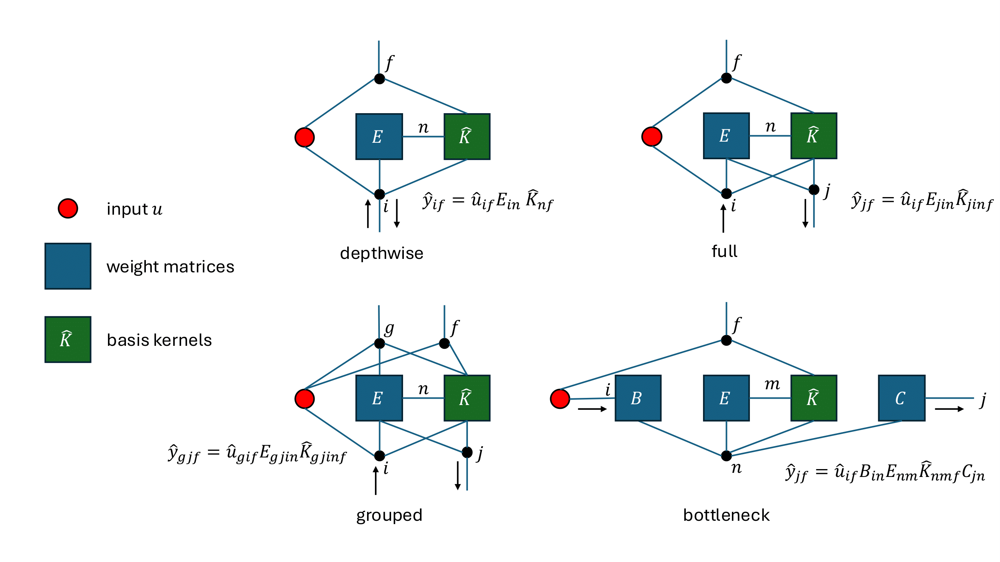

# Centaurus ([paper link])

<div align="center">
  
</div>

Centaurus is a deep SSM that allows for flexible channel connectivity (much like convolutional neural networks), 
which is enabled by optimal tensor contractions. 
It is an extension of our [aTENNuate network](https://github.com/Brainchip-Inc/aTENNuate), 
now adapted for several audio tasks such as keyword spotting, denoising, and ASR.

## Quickstart

<div align="center">
  
</div>

It is easy to create a Centaurus SSM layer, similar to how you would for Conv1d layer. 
The only addition is that you need to specify a `num_states` argument to specify the 
number of internal states parameterizing the layer connection (based on the `mode`). 
For example,

```python
from centaurus import SSMLayer

layer = SSMLayer(
    num_states=16, 
    in_channels=4, 
    out_channels=8, 
    mode='full', 
)
```

would yield a "full" SSM layer, where every pairing of the 4 input channels and the 8 output channels 
is "connected" via 16 internal states. Currently, the supported SSM layer modes are:

1. `'dws'`, depthwise-separable, similar to [S4D](https://arxiv.org/abs/2206.11893)
2. `'s5'`, pointwise-bottleneck, similar to [S5](https://arxiv.org/abs/2208.04933)
3. `'neck'`, bottleneck, inspired by the [inverted residual bottleneck block](https://paperswithcode.com/method/inverted-residual-block)
4. `'full'`, inspired by the full convolution layer

Internally, the `SSMLayer` would optimize the order of the SSM operations based on the 
received input features, such as the batch size and length.

### Building a network

You can build your own Centaurus network by (for instance) stacking these SSM layers in a sequence, 
with optional downsampling operations in between.

```python
class MiniCentaur(nn.Module):
    def __init__(self):
        super().__init__()
        self.backbone = nn.Sequential(
            SSMLayer(16, 1, 4, mode='full', use_activations=True), nn.AvgPool1d(4), 
            SSMLayer(16, 4, 8, mode='neck', use_activations=True), nn.AvgPool1d(2), 
            SSMLayer(16, 8, 16, mode='s5', state_blocks=4), 
        )
        
    def forward(self, input):
        return self.backbone(input)
        
    def set_run_mode(self, mode):
        for layer in self.backbone:
            if isinstance(layer, SSMLayer):
                layer.set_run_mode(mode)
            
    def reset_states(self):
        for layer in self.backbone:
            if isinstance(layer, SSMLayer):
                layer.reset_state()
```

The methods `set_run_mode`, and `reset_states` are explained in the next section.

### ⚠️ Important Note

It is highly recommended to train the Centaurus network with `torch.compile`, as there are subroutines 
that expect it. We also support (and encourage) training the network with `torch.autocast` enabled 
as well (fp16 mixed precision).

## Real-time Inference

An advantage of SSMs is that they can be easily adapted for real-time inference, due to them 
admitting a recurrent form. To enable this, we provide a (semi-optimized) inference pipeline 
that caches internal states for each SSM layer. Thus, the inputs can be fed into the network 
in chunks, and the network can generate outputs in chunks as well (in real-time).

Taking the above `MiniCentaur` network as example,

```python
torch.set_grad_enabled(False)
model = MiniCentaur()
model.eval()

input = torch.rand(4, 1, 128)
output = model(input)  # fed into the network all at once

model.set_run_mode('inference')
output_chunks = []
# fed into the network in chunks
for input_chunk in input.split(32, -1):
    output_chunks.append(model(input_chunk))
output_chunks = torch.cat(output_chunks, -1)
model.reset_states()  # zero all internal states

assert torch.allclose(output, output_chunks)
```

the state-caching behavior can be enabled by `model.set_run_mode('inference')`, from the default 
mode of `'training'` which does not perform state-caching. Besides state-caching, the inference 
pipeline also caches the SSM (basis) kernels, as they do not change during inference, thus do not 
need to be generated each inference pass by the state matrices.

## Contact + Contribution

Please submit a Github issue if you find any bugs. 
If you'd like to contribute a new feature, feel free to open a Github issue to discuss, or email yanrpei@gmail.com.

## Citation

If you find Centaurus useful, please consider citing the [Centaurus paper] paper:
